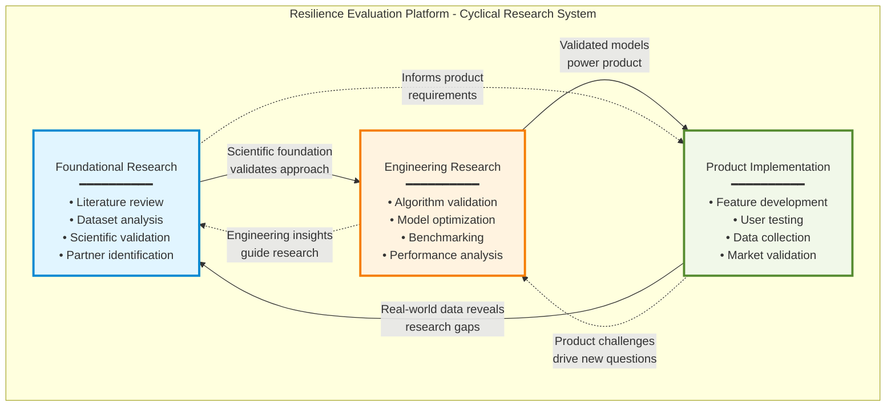

## Strategic Research & Product Development Roadmap

**Document Purpose**: This document outlines the three-node cyclical research strategy for validating and developing our data-driven resilience evaluation platform.

**Validation Timeline**: 3-6 months

---

## Executive Summary

Our strategy employs a three-node cyclical research framework where foundational research, engineering validation, and product development continuously inform and improve each other. This approach ensures our product is built on solid scientific foundations while maintaining agility to pivot based on real-world results.

**Current State**: We have a working prototype built on initial data. Now we need to validate our evaluation algorithm, explore better methodologies, and establish why our chosen approach is optimal.

**Focus Area**: Mental/emotional resilience, stress resilience, and workplace resilience evaluation

**Core Philosophy**: Validate → Optimize → Scale (across all three nodes simultaneously with good documentation)

---

## I. The Three-Node Research Framework

### Visual Representation



**Alternative Text Representation:**
```
┌─────────────────────────────────────────────────────────────────┐
│                    RESILIENCE EVALUATION SYSTEM                  │
│                                                                  │
│  ┌──────────────────────────────────────────────────────────┐  │
│  │  NODE 1: FOUNDATIONAL RESEARCH                           │  │
│  │  • What do we know about resilience measurement?         │  │
│  │  • What methods exist? What datasets are available?      │  │
│  │  • Is our scientific foundation solid?                   │  │
│  └────────────────┬─────────────────────────────────────────┘  │
│                   │                                             │
│                   │ Validates approach                          │
│                   ↓                                             │
│  ┌──────────────────────────────────────────────────────────┐  │
│  │  NODE 2: ENGINEERING RESEARCH                            │  │
│  │  • Does our algorithm make sense?                        │  │
│  │  • Are there better methods?                             │  │
│  │  • How do we benchmark? Is our evaluation right?         │  │
│  └────────────────┬─────────────────────────────────────────┘  │
│                   │                                             │
│                   │ Powers product                              │
│                   ↓                                             │
│  ┌──────────────────────────────────────────────────────────┐  │
│  │  NODE 3: PRODUCT IMPLEMENTATION                          │  │
│  │  • Does it work with real users?                         │  │
│  │  • What value does it deliver?                           │  │
│  │  • Can we collect the right data?                        │  │
│  └────────────────┬─────────────────────────────────────────┘  │
│                   │                                             │
│                   │ Reveals gaps & new questions                │
│                   ↓                                             │
│                (Back to NODE 1)                                 │
│                                                                  │
│  ══════════════════════════════════════════════════════════    │
│  Continuous feedback loops between all three nodes              │
│  ══════════════════════════════════════════════════════════    │
└──────────────────────────────────────────────────────────────────┘
```

### Node Interaction Principles
- **Continuous Feedback**: Insights from each node inform the others
- **Scientific Rigor**: Node 1 validates Node 2; Node 2 validates Node 3
- **Market Reality**: Node 3 challenges assumptions in Nodes 1 & 2
- **Iterative Refinement**: Each cycle improves all components

---

## II. Node 1: Foundational Research
### **Objective**: Validate scientific credibility and identify optimization opportunities

**Current Context**: We have initial data and a working prototype. We need to understand if our approach aligns with established research and where we can improve.

### Primary Research Questions

#### A. Resilience Measurement Landscape (Mental/Emotional/Stress/Workplace)
1. **What are the validated frameworks for resilience measurement?**
   - Mental/Emotional: Connor-Davidson Resilience Scale (CD-RISC), Resilience Scale for Adults (RSA)
   - Stress Resilience: Brief Resilience Scale (BRS), Perceived Stress Scale (PSS)
   - Workplace: Workplace Resilience Inventory, occupational stress measures
   - How do these frameworks compare? Which is most appropriate for our use case?

2. **What types of data predict resilience outcomes?**
   - Physiological: Heart rate variability (HRV), skin conductance, sleep patterns
   - Behavioral: Activity levels, social interactions, digital engagement patterns
   - Self-reported: Mood logs, stress assessments, coping strategy use
   - Contextual: Work demands, life events, social support
   - **Key question**: What data are we collecting? What should we be collecting?

3. **How is resilience validated in research?**
   - Longitudinal studies: Do resilience scores predict future stress responses?
   - Convergent validity: Do our measures correlate with established scales?
   - Clinical outcomes: Do high-resilience individuals have better mental health?
   - Intervention studies: Does resilience improve with training?

#### B. Algorithm & Methodology Validation
1. **What methods exist for computing resilience scores?**
   - Simple aggregation (sum of protective factors)
   - Weighted scoring (clinical expert weights)
   - Machine learning approaches (predictive models)
   - Dynamic systems models (resilience as a process, not trait)

2. **How does our current algorithm compare?**
   - What assumptions does our algorithm make?
   - Are these assumptions validated in the literature?
   - What are the limitations of our approach?
   - Where might we be missing important signals?

3. **What are alternative approaches we should consider?**
   - Different feature engineering strategies
   - Alternative model architectures
   - Multi-modal data fusion techniques
   - Temporal modeling (how resilience changes over time)

#### C. Datasets & Benchmarks
1. **What datasets exist for stress and resilience research?**
   - WESAD (Wearable Stress and Affect Detection)
   - SWELL-KW (Knowledge Work and Stress)
   - Workplace stress datasets
   - Mental health monitoring datasets (DAIC-WOZ, etc.)
   - **Are any of these suitable for benchmarking our algorithm?**

2. **Can we access validation data?**
   - Clinical datasets with ground-truth resilience assessments
   - Longitudinal studies tracking stress recovery
   - Intervention studies showing resilience improvement
   - **How can we validate our algorithm against gold standards?**

3. **What data are we missing?**
   - Coverage gaps in our current data collection
   - Important signals we're not capturing
   - Demographic or context blind spots
   - Frequency/granularity issues

#### D. Scientific Partnerships & Credibility
1. **Who are the leading researchers in resilience?**
   - Academic institutions: Penn Resilience Program, Duke Behavioral Medicine Lab
   - Clinical researchers focused on stress and workplace wellbeing
   - Industry researchers (Microsoft Research on productivity, Google on digital wellbeing)

2. **What would strengthen our scientific credibility?**
   - Academic collaborations or advisors
   - Peer-reviewed validation studies
   - Clinical partnerships for ground truth data
   - Conference presentations or publications

### Critical Questions for Our Algorithm
**These questions directly address your validation needs:**

1. **Correctness**: Does our algorithm make sense given what research says about resilience?
   - Are we measuring the right constructs?
   - Are our weights/importance assignments justified?
   - Do we handle temporal dynamics appropriately?

2. **Comparison**: How does our approach compare to alternatives?
   - Benchmark against published methods on public datasets (make note of them)
   - Compare different algorithms on our own data
   - Ablation studies: what happens if we remove components?

3. **Optimality**: Is our chosen method the best?
   - What are the trade-offs? (accuracy vs interpretability vs real-time vs cost)
   - Under what conditions would a different method be better?
   - Can we quantify the improvement from better methods?

4. **Validation**: How do we know our output is meaningful?
   - Does it correlate with self-reported resilience?
   - Does it predict stress recovery or mental health outcomes?
   - Do users find the scores/feedback valuable?

### Deliverables (Node 1)
- **Literature Review Report**: Focused on resilience measurement methods and validation (2-week deliverable)
- **Algorithm Comparison Matrix**: Our method vs. alternatives with pros/cons (4-week deliverable)
- **Dataset Evaluation Report**: Available datasets and our access strategy (4-week deliverable)
- **Scientific Validation Plan**: How we'll establish credibility (6-week deliverable)
- **Research Gaps Document**: What questions remain unanswered (ongoing)

### Timeline: Intensive first 4 weeks, then ongoing (2-4 hours/week) (adjustable)

---

## III. Node 2: Engineering Research
### **Objective**: Validate current algorithm and identify optimal approaches

**Current Context**: We have a working prototype with an evaluation algorithm. We need to rigorously test whether it makes sense, compare it to alternatives, and determine if it's the best approach.

### Primary Research Questions

#### A. Current Algorithm Validation
1. **Does our algorithm make sense?**
   - Document current algorithm: What exactly are we computing?
   - Theoretical justification: Why should this work?
   - Assumption checking: What assumptions are we making? Are they valid?
   - Edge case analysis: When does our algorithm fail or give nonsensical results?

2. **What is our ground truth?**
   - How do we define "correct" resilience scores?
   - Self-reported scales (CD-RISC, BRS, etc.)
   - Clinical assessments
   - Behavioral outcomes (stress recovery, mental health)
   - Expert ratings
   - **Do we have ground truth data to validate against?**

3. **How well does our algorithm perform?**
   - Correlation with validated scales
   - Prediction of future stress/resilience outcomes
   - Sensitivity to changes (does it detect resilience improvement?)
   - Stability (test-retest reliability)
   - User perception (do users find scores accurate?)

#### B. Alternative Methods Exploration
1. **What other approaches exist?**
   - Simple scoring: Sum or average of resilience factors
   - Weighted models: Clinical expert weights or data-driven weights
   - Machine learning: Regression, classification, or ranking models
   - Composite indices: Multi-dimensional resilience profiles
   - Dynamic models: Tracking resilience trajectories over time

2. **How do alternatives compare on our data?**
   - Implement 3-5 alternative methods
   - Compare performance on same dataset
   - Statistical significance testing
   - Trade-off analysis: accuracy vs. interpretability vs. computational cost

3. **What do ablation studies reveal?**
   - Remove components one at a time
   - Which features/signals are most important?
   - Which parts of our algorithm contribute most to performance?
   - Can we simplify without losing performance?

#### C. Benchmarking & Evaluation Strategy
1. **How should we evaluate resilience algorithms?**
   - Metrics for regression: RMSE, MAE, R²
   - Metrics for classification: Accuracy, F1, AUC-ROC
   - Clinical metrics: Sensitivity, specificity for risk identification
   - User-centric metrics: Do scores match user self-perception?

2. **Is our evaluation method appropriate?**
   - Cross-validation strategy
   - Train/test split (temporal? random? stratified?)
   - Handling of missing data
   - Avoiding data leakage
   - Sample size considerations: Do we have enough data?

3. **How do we benchmark against published work?**
   - Identify comparable papers with reported metrics
   - Attempt to replicate their methods on our data
   - Test our method on public datasets (WESAD, SWELL-KW)
   - Fair comparison: Same data, same evaluation protocol

#### D. Model Optimization
1. **Can we improve performance?**
   - Feature engineering: Better representations of raw data
   - Hyperparameter tuning: Optimal settings for our algorithm
   - Ensemble methods: Combining multiple approaches
   - Transfer learning: Leveraging models from related domains

2. **What about personalization?**
   - User-specific models vs. population-level models
   - Adaptation over time as we learn about individual users
   - Demographic or context-specific models
   - Cold start problem: How to handle new users?

3. **What are the deployment constraints?**
   - Latency requirements: How fast must predictions be?
   - Resource constraints: Mobile device, cloud, or hybrid?
   - Data requirements: How much data needed for accurate scores?
   - Update frequency: Real-time, hourly, daily?

### Critical Validation Experiments

**Experiment 1: Ground Truth Comparison**
- Collect validated resilience scale scores (CD-RISC, BRS) from users
- Compare our algorithm output with these scores
- Compute correlation and agreement metrics
- **Success criteria**: r > 0.6, or whatever threshold makes sense

**Experiment 2: Alternative Methods Comparison**
- Implement 3-5 different algorithms
- Test on held-out data
- Statistical comparison of performance
- **Success criteria**: Our method is competitive or superior, or we identify a better method

**Experiment 3: Longitudinal Validation**
- Track users over time (if we have longitudinal data)
- Does resilience score change with interventions?
- Does it predict future stress or wellbeing?
- **Success criteria**: Scores are predictive and responsive to change

**Experiment 4: Ablation Study**
- Systematically remove features or components
- Measure impact on performance
- **Success criteria**: Understand what drives performance, simplify if possible

**Experiment 5: Benchmark on Public Data**
- Apply our algorithm to WESAD or similar dataset
- Compare to published results
- **Success criteria**: Performance comparable to or better than published methods

### Deliverables (Node 2)
- **Algorithm Documentation**: Complete description of current method (Week 1-2)
- **Validation Report**: How our algorithm performs vs. ground truth (Week 4-6)
- **Alternative Methods Report**: Comparison of 3-5 approaches (Week 6-8)
- **Benchmarking Report**: Our performance vs. published work (Week 8-10)
- **Optimization Recommendations**: How to improve algorithm (Week 10-12)
- **Model Registry**: Versioned algorithms with performance metadata (Ongoing)

### Timeline: Intensive Weeks 1-12, then iterative refinement

### Owner: **Data Science Intern (90%) + Software Engineering Intern (10%)**

---

## IV. Node 3: Product Implementation
### **Objective**: Enhance prototype, establish data collection, validate market value

**Current Context**: We have a working prototype built on initial data. We need to improve data collection mechanisms, enhance the product based on research findings, and validate that it delivers real value to users.

### Primary Research Questions

#### A. Data Collection Strategy
1. **What data do we currently collect?**
   - Inventory of current data sources
   - Frequency and completeness of data
   - Quality and reliability issues
   - User compliance with data collection

2. **What additional data should we collect?**
   - Based on Node 1 research: What signals matter most?
   - Based on Node 2 validation: What would improve our algorithm?
   - Feasibility: What can users realistically provide?
   - Privacy: What are users comfortable sharing?

3. **How should we collect data?**
   - Passive collection: Wearables, phone sensors, digital behavior
   - Active collection: Check-ins, surveys, mood logs
   - Frequency: Real-time, hourly, daily, weekly?
   - Platform: Mobile app, web, API integrations, manual entry
   - **What mechanisms need to be built vs. improved?**

#### B. Product Enhancement
1. **How do we incorporate research findings?**
   - Integrate improved algorithm from Node 2
   - Adjust data collection based on Node 1 insights
   - Implement better evaluation methods
   - Add features that research suggests are important

2. **What's the user experience?**
   - Onboarding: How do we explain resilience evaluation to users?
   - Data input: Make collection effortless and non-intrusive
   - Feedback: How do we present resilience scores/insights?
   - Action: What do users do with this information?
   - Privacy: How do we communicate data use and protection?

3. **What are the MVP features for validation?**
   - Core: Resilience assessment and scoring
   - Essential: Data collection and tracking
   - Important: Feedback and insights
   - Nice-to-have: Interventions, recommendations, progress tracking

#### C. Validation & User Testing
1. **Does the product deliver value?**
   - User satisfaction: Do people find it useful?
   - Accuracy perception: Do scores match self-perception?
   - Actionability: Can users improve their resilience using our product?
   - Retention: Do users keep using it?
   - Outcomes: Does resilience actually improve? Stress decrease?

2. **What's the testing strategy?**
   - Beta program: 15-30 users for 4-8 weeks
   - User interviews: Qualitative feedback
   - Usage analytics: What features are used? Where do users drop off?
   - A/B testing: Compare algorithm versions or features
   - Survey data: NPS, satisfaction, perceived value

3. **Who should we test with?**
   - Target user personas:
     * High-stress professionals (workplace resilience focus)
     * Individuals managing mental health (emotional resilience focus)
     * Organizations/HR teams (employee wellbeing programs)
   - Diverse demographics for generalizability
   - Early adopters vs. skeptics

#### D. Product-Market Fit Exploration
1. **What value propositions resonate?**
   - B2C: "Understand and improve your stress resilience"
   - B2B: "Identify at-risk employees and improve wellbeing"
   - Clinical: "Data-driven resilience assessment for therapy"
   - Research: "Validated resilience measurement tool"

2. **What are the adoption barriers?**
   - Trust: Do people trust our assessments?
   - Privacy: Concerns about data collection
   - Effort: Is data collection too burdensome?
   - Value: Is the payoff worth the effort?
   - Cost: What would people/organizations pay?

3. **What's our go-to-market learning plan?**
   - Customer development interviews: 20-30 interviews
   - Pilot partnerships: 2-3 organizations willing to test
   - Pricing experiments: Willingness to pay studies
   - Competitive positioning: How do we compare to alternatives?
   - **Note**: This is preliminary research, not full GTM strategy

#### E. Technical Infrastructure
1. **What needs to be built or improved?**
   - Data pipeline: Ingestion, processing, storage
   - Model deployment: Integration of validated algorithm
   - API: For data input and score retrieval
   - Dashboard: User interface for insights
   - Backend services: Authentication, data security, scalability

2. **What are the quality requirements?**
   - Reliability: System uptime and availability
   - Performance: Response times, data processing speed
   - Security: Data encryption, access controls
   - Privacy: Compliance with data protection regulations
   - Monitoring: Error tracking, usage analytics

### Key Product Validation Questions

1. **Usability**: Can people easily use our product to track resilience?
2. **Accuracy**: Do our scores make sense to users?
3. **Value**: Does it help users improve their resilience or manage stress?
4. **Feasibility**: Can we collect the necessary data reliably?
5. **Scalability**: Can we support growth without breaking?

### Deliverables (Node 3)
- **Data Collection Plan**: What, how, when, and why (Week 2-4)
- **Product Enhancement Roadmap**: Features prioritized by impact (Week 4-6)
- **Beta Testing Plan**: Recruitment, protocol, metrics (Week 6-8)
- **User Research Report**: Interviews and feedback synthesis (Week 10-12)
- **Pilot Program Results**: Quantitative and qualitative findings (Week 16-20)
- **Technical Architecture Update**: Reflecting improvements (Week 8-10)
- **Product-Market Fit Report**: Preliminary insights (Week 20-24)

### Timeline: Enhancement begins Week 4, testing intensifies Week 8+

### Owner: **Software Engineering Intern (60%) + Data Science Intern (40%)**

---

## V. Execution Strategy

### A. Phasing Approach: **Parallel with Staged Intensity**

#### Rationale
Given we have a working prototype and a 3-6 month validation timeline, we need an aggressive approach:
- All three nodes work in parallel from the start
- Intensity shifts between nodes based on dependencies and milestones
- Faster iteration cycles to maximize learning within the timeline

**Why Parallel?**
- We already have a prototype, so we're not starting from scratch
- 3-6 months is tight for comprehensive validation
- Research findings need to quickly feed into product improvements
- User feedback should inform research priorities

### Phase Breakdown (3-6 Month Timeline)

#### **Phase 1: Rapid Assessment & Foundation (Weeks 1-4)**
**Focus**: All nodes active - Understand what we have and what's needed

**Node 1 Priorities (30%)**:
- Quick literature review focused on resilience measurement methods
- Identify key datasets for benchmarking
- Document what makes algorithms "correct" in this domain

**Node 2 Priorities (50%)**:
- Document and analyze current algorithm thoroughly
- Identify 3-5 alternative methods to test
- Set up evaluation framework and metrics
- Begin validation experiments on existing data

**Node 3 Priorities (20%)**:
- Audit current data collection mechanisms
- Plan improvements to data collection
- Begin user research (interviews with potential users)

**Key Milestones**:
- Week 2: Current algorithm fully documented
- Week 3: Literature review v1 complete (focused on methods)
- Week 4: Alternative methods identified, evaluation plan ready

**Team Allocation**:
- Data Science Intern: 40% Node 1, 60% Node 2
- Software Engineering Intern: 20% Node 1 (tools), 30% Node 2 (infrastructure), 50% Node 3
- Strategy Lead: Overall coordination, research guidance, user research planning

---

#### **Phase 2: Intensive Validation & Testing (Weeks 5-12)**
**Focus**: Validate current approach, test alternatives, begin user testing

**Node 1 Priorities (20%)**:
- Deep dive into specific methodology questions
- Reach out to academic/clinical partners
- Access benchmark datasets

**Node 2 Priorities (50%)**:
- Run all validation experiments
- Implement and test alternative methods
- Statistical comparison and analysis
- Ablation studies to understand current algorithm
- Benchmark on public datasets

**Node 3 Priorities (30%)**:
- Improve data collection based on research findings
- Launch beta testing program (Week 8)
- Implement algorithm improvements
- Collect user feedback continuously

**Key Milestones**:
- Week 6: Validation experiments complete (ground truth comparison)
- Week 8: Beta program launched with 15-20 users
- Week 10: Alternative methods comparison report
- Week 12: Optimization recommendations ready

**Team Allocation**:
- Data Science Intern: 20% Node 1, 60% Node 2, 20% Node 3 (model integration)
- Software Engineering Intern: 10% Node 2, 90% Node 3
- Strategy Lead: Decision-making based on findings, pilot partner discussions

---

#### **Phase 3: Integration & Iteration (Weeks 13-20)**
**Focus**: Implement best approaches, scale user testing, validate value

**Node 1 Priorities (10%)**:
- Ongoing monitoring of research developments
- Prepare validation study for publication/sharing
- Solidify scientific partnerships

**Node 2 Priorities (30%)**:
- Implement optimal algorithm based on testing
- Continuous monitoring and improvement
- Prepare technical documentation
- Plan for scalability

**Node 3 Priorities (60%)**:
- Scale beta program (30-50 users)
- Pilot partnerships (2-3 organizations)
- Product improvements based on feedback
- Measure outcomes and value delivered

**Key Milestones**:
- Week 14: Improved algorithm deployed to production
- Week 16: Pilot partnerships established
- Week 18: 30+ beta users, initial outcome data
- Week 20: Product-market fit assessment

**Team Allocation**:
- Data Science Intern: 10% Node 1, 30% Node 2, 60% Node 3 (analytics, insights)
- Software Engineering Intern: 10% Node 2, 90% Node 3
- Strategy Lead: Founder updates, strategic decisions, partnerships

---

#### **Phase 4: Decision Point (Weeks 21-24, if extending to 6 months)**
**Focus**: All nodes - Synthesize learning and decide next steps

**Node 1**: 
- Complete scientific validation report
- Finalize academic partnerships or publication plans

**Node 2**: 
- Finalize technical documentation
- Performance benchmarking report for stakeholders

**Node 3**: 
- Product-market fit report
- Go-to-market recommendations
- Scale or pivot decisions

**Key Milestones**:
- Week 22: Comprehensive validation report (all nodes)
- Week 24: Founder presentation and strategic recommendations

---

### B. Rapid Iteration Cycles

Given the tight timeline, we use **2-week sprints** with the following rhythm:

**Week 1 of Sprint**:
- Monday: Sprint planning (2 hours)
  - Review previous sprint results
  - Set goals for next 2 weeks
  - Assign specific tasks
- Mid-week: Async check-ins (Slack updates)
- Friday: Show-and-tell (1 hour)
  - Demos, findings, blockers

**Week 2 of Sprint**:
- Monday: Mid-sprint sync (1 hour)
  - Progress check
  - Adjust priorities if needed
- Wednesday: Cross-node collaboration (1 hour)
  - Share insights across nodes
  - Identify dependencies
- Friday: Sprint review & retro (1.5 hours)
  - What did we learn?
  - What worked? What didn't?
  - Prepare for founder update (every 4 weeks)

**This gives us**:
- 8-10 sprint cycles in 20 weeks (minimum validation)
- 12 sprint cycles in 24 weeks (if extending to 6 months)
- Rapid learning and adjustment
- Regular checkpoints for decision-making

### C. Visual Timeline: Node Intensity by Phase

```
WEEKS:  1  2  3  4  5  6  7  8  9  10 11 12 13 14 15 16 17 18 19 20 21 22 23 24
        └─────────┘ └──────────────────┘ └──────────────────┘ └──────────────┘
         PHASE 1       PHASE 2              PHASE 3             PHASE 4

NODE 1  ████████████ ████████░░░░░░░░░░░░ ████░░░░░░░░░░░░░░ ██░░░░░░░░░░░░
        [Intense]     [Moderate]           [Light]            [Minimal]
        
NODE 2  ██████████████████████████████████████████████████ ████████░░░░░░░░
        [Building]    [Peak Intensity]      [Optimization]     [Documentation]
        
NODE 3  ████░░░░░░░░ ████████████░░░░░░░░ ████████████████████████████████
        [Planning]    [Development]         [Peak: Testing]    [Analysis]

Legend: █ = High intensity  ░ = Lower intensity

PHASE 1 (Weeks 1-4): Foundation
  • Node 1: Rapid literature review and framework establishment
  • Node 2: Document current algorithm, plan experiments
  • Node 3: Plan improvements, begin user research

PHASE 2 (Weeks 5-12): Validation
  • Node 1: Deep dives on specific questions
  • Node 2: PEAK - All validation experiments, comparisons, benchmarking
  • Node 3: Build improvements, launch beta testing

PHASE 3 (Weeks 13-20): Integration & Scale
  • Node 1: Minimal - ongoing monitoring
  • Node 2: Deploy optimal algorithm, monitor performance
  • Node 3: PEAK - Scale users, measure outcomes, validate value

PHASE 4 (Weeks 21-24): Synthesis (if extending to 6 months)
  • All nodes: Documentation, reporting, strategic recommendations
```

---

## VI. Success Metrics by Node

### Node 1: Foundational Research
✓ **Targeted literature review complete** (30-50 relevant papers on resilience measurement methods)  
✓ **3-5 benchmark datasets** identified and evaluated for algorithm testing  
✓ **Algorithm validation framework** established based on literature  
✓ **2-3 academic/clinical partnerships** initiated for validation or collaboration  
✓ **Research gaps documented** - what we know vs. what we need to know  
✓ **Scientific credibility plan** - path to publication or peer validation

### Node 2: Engineering Research
✓ **Current algorithm validated** - understand why it works (or doesn't)  
✓ **3-5 alternative methods tested** on our data with statistical comparison  
✓ **Benchmark performance** on public dataset (WESAD or similar)  
✓ **Ground truth validation**: r > 0.6 with validated scales (or justified threshold)  
✓ **Ablation study complete** - know which components drive performance  
✓ **Optimal method identified** - can justify "this is our best approach because..."  
✓ **Performance improvement**: X% better than baseline (quantified)  
✓ **Documentation complete** - reproducible research pipeline

### Node 3: Product Implementation
✓ **Data collection improved** based on research findings  
✓ **Beta program launched**: 15-20 users by Week 8, 30+ by Week 18  
✓ **User feedback collected**: 10+ interviews + usage analytics  
✓ **Value validated**: Users report finding scores accurate/useful (NPS > 40)  
✓ **Pilot partnerships**: 2-3 organizations engaged  
✓ **Retention signal**: 50%+ of beta users active week-over-week  
✓ **Outcome evidence**: Preliminary data showing resilience/stress improvement  
✓ **Technical reliability**: System functional and stable for user testing

### Cross-Node Success Criteria
✓ **Research informs product**: Can trace algorithm improvements to research findings  
✓ **Product informs research**: User data reveals new research questions  
✓ **Scientific + practical**: Both technically sound AND useful to users  
✓ **Decision-ready**: Clear recommendation for founders on next steps by Week 20-24

---

## VII. Risk Mitigation

### Research Risks
| Risk | Impact | Mitigation |
|------|--------|------------|
| Insufficient quality datasets | High | Early dataset audit; partnerships with clinical institutions; consider synthetic data |
| Model doesn't validate clinically | High | Continuous clinical expert consultation; pilot with practitioners |
| Slow research progress | Medium | Weekly check-ins; clear milestone tracking; adjust scope if needed |

### Product Risks
| Risk | Impact | Mitigation |
|------|--------|------------|
| Technical complexity exceeds capacity | High | Prioritize ruthlessly; consider third-party services; phase features |
| Poor user adoption | High | Early user research; beta testing; iterate quickly |
| Privacy/security breach | Critical | Security audit; compliance review; insurance |

### Team Risks
| Risk | Impact | Mitigation |
|------|--------|------------|
| Intern bandwidth limitations | Medium | Clear scope; realistic timelines; mentorship support |
| Knowledge silos | Medium | Documentation; knowledge sharing sessions; cross-training |
| Burnout | Medium | Sustainable pace; celebrate wins; clear priorities |

---

## VIII. Team Structure & Meeting Cadence

### Roles & Responsibilities

**Strategy Lead (You)**
- Vision setting and strategic decisions
- Research direction and priority setting
- Unblocking team and making key decisions
- External relationship building (academic partners, pilot users)
- Bi-weekly founder updates
- **Time commitment**: 8-12 hours/week

**Data Science Intern**
- **Primary owner**: Node 1 & Node 2
- **Secondary support**: Node 3 (model integration, analytics)
- **Key deliverables**: 
  - Literature review and research synthesis
  - Algorithm validation and comparison
  - Model development and optimization
  - Performance reports
- **Time commitment**: Full-time on project

**Software Engineering Intern**
- **Primary owner**: Node 3
- **Secondary support**: Node 2 (deployment infrastructure, experiment tools)
- **Key deliverables**: 
  - Data collection improvements
  - Product enhancements
  - Beta testing infrastructure
  - User analytics and monitoring
- **Time commitment**: Full-time on project

### Meeting Cadence

**2-Week Sprint Cycle**

**Sprint Week 1**:
- **Monday (2 hours)**: Sprint Planning
  - Review previous sprint
  - Set sprint goals
  - Assign tasks and priorities
  - Identify cross-node dependencies
  
- **Wednesday (30 min)**: Quick async check-in
  - Slack updates on progress
  - Flag any blockers
  
- **Friday (1 hour)**: Show-and-tell
  - Quick demos of work in progress
  - Share interesting findings
  - Collaborate on challenges

**Sprint Week 2**:
- **Monday (1 hour)**: Mid-sprint sync
  - Progress check
  - Adjust if needed
  - Resolve blockers
  
- **Wednesday (1 hour)**: Cross-node collaboration
  - Node 1 findings → Node 2 implications
  - Node 2 results → Node 3 implementation
  - Node 3 user feedback → Node 1 questions
  
- **Friday (1.5 hours)**: Sprint Review & Retrospective
  - Demo completed work
  - What did we learn?
  - What worked? What didn't?
  - Plan next sprint

**Every 4 Weeks**:
- **Founder Update (1 hour)**: Presentation + discussion
  - Progress against success metrics
  - Key learnings and insights
  - Decisions needed
  - Resource needs

**Ad-hoc**:
- **Daily Slack updates**: End of day progress notes
- **Emergency syncs**: As needed for urgent decisions
- **1-on-1s**: Strategy Lead with each intern (biweekly, 30 min each)

---

## IX. Detailed Task Breakdown

### Node 1: Foundational Research - Detailed Questions

#### Week 1-2: Setup & Initial Survey
- [ ] Set up reference management system (Zotero/Mendeley)
- [ ] Create shared research database (Notion/Airtable)
- [ ] Define search strategy (keywords, databases, inclusion criteria)
- [ ] Conduct initial literature search (Google Scholar, PubMed, IEEE)
- [ ] Read 10 seminal papers on emotional AI and resilience

**Questions to Answer**:
1. What are the top 10 most-cited papers on resilience measurement?
2. What are the top 5 most-cited papers on emotional AI?
3. What are the most common emotional data modalities used in research?
4. What are the reported accuracies/validations of existing resilience tools?

#### Week 3-4: Deep Dive
- [ ] Focus on resilience frameworks (clinical psychology)
- [ ] Focus on emotional data analysis (ML/AI perspective)
- [ ] Identify dataset sources (Kaggle, UCI, specialized repositories)
- [ ] Begin reaching out to potential academic partners

**Questions to Answer**:
1. Which resilience framework is most widely validated?
2. Can we access the validation data for existing resilience scales?
3. What are the temporal dynamics of emotional data? (hours, days, weeks?)
4. Which institutions have IRB-approved emotional data collection?

#### Week 5-6: Synthesis
- [ ] Complete first literature review report
- [ ] Document all identified datasets (access, cost, characteristics)
- [ ] Create comparison matrix of resilience frameworks
- [ ] Identify 3-5 specific research gaps we could fill

**Questions to Answer**:
1. What is our working definition of resilience?
2. Which specific gaps will our product address?
3. What data do we need that's not currently available?
4. Who are the top 5 researchers we should try to connect with?

---

### Node 2: Engineering Research - Detailed Questions

#### Weeks 3-6: Baseline Establishment
- [ ] Download and clean 2-3 public datasets
- [ ] Implement simple baseline models (Logistic Regression, Random Forest)
- [ ] Define evaluation metrics
- [ ] Set up experiment tracking (MLflow, Weights & Biases)

**Questions to Answer**:
1. What's the baseline accuracy we can achieve with simple models?
2. What features are most predictive in existing datasets?
3. What's the class balance? Do we need to handle imbalance?
4. How much data do we need for reliable predictions?

#### Weeks 7-10: Model Development
- [ ] Implement 5+ different model architectures
- [ ] Conduct hyperparameter tuning
- [ ] Feature engineering experiments
- [ ] Cross-validation and temporal validation

**Questions to Answer**:
1. Which model architecture performs best?
2. What's the performance gap between simple and complex models?
3. Are there diminishing returns with model complexity?
4. What's the trade-off between performance and interpretability?

#### Weeks 11-14: Validation & Benchmarking
- [ ] Compare against published benchmarks
- [ ] Implement explainability tools (SHAP, LIME)
- [ ] Conduct ablation studies
- [ ] Statistical significance testing

**Questions to Answer**:
1. Can we match or exceed published results?
2. Which features contribute most to predictions?
3. Are our results statistically significant?
4. Can we explain predictions in clinically meaningful ways?

#### Weeks 15-18: Optimization & Deployment Prep
- [ ] Model optimization (pruning, quantization if needed)
- [ ] Latency and throughput testing
- [ ] Create model documentation
- [ ] Package model for deployment

**Questions to Answer**:
1. What's the inference time for our model?
2. Can we deploy on edge devices or need server-side?
3. What's the model size and memory footprint?
4. How do we handle model versioning and updates?

---

### Node 3: Product Implementation - Detailed Questions

#### Weeks 6-8: Scoping & Design
- [ ] Define MVP feature list
- [ ] Create user personas
- [ ] Design user flows
- [ ] Create wireframes
- [ ] Technical architecture document

**Questions to Answer**:
1. What's the absolute minimum for a useful product?
2. What data do we need from users?
3. How often should users interact with the product?
4. What platforms do we support? (iOS, Android, Web)
5. What's the onboarding flow?

#### Weeks 9-12: Core Development
- [ ] Set up development environment
- [ ] Build data collection module
- [ ] Implement authentication and user management
- [ ] Create basic UI for data input
- [ ] Build data pipeline (ingestion, processing, storage)

**Questions to Answer**:
1. How do we securely store user data?
2. What's our data backup strategy?
3. How do we handle offline functionality?
4. What permissions do we need from users?

#### Weeks 13-16: Integration & Testing
- [ ] Integrate ML model with backend
- [ ] Implement resilience scoring/feedback
- [ ] Build dashboard for users
- [ ] Comprehensive testing (unit, integration, E2E)
- [ ] Beta testing preparation

**Questions to Answer**:
1. How do we deliver feedback to users?
2. What visualizations are most useful?
3. How do we handle edge cases and errors?
4. What's the user experience for first-time vs. returning users?

#### Weeks 17-20: Beta & Iteration
- [ ] Launch beta program
- [ ] Collect user feedback
- [ ] Implement analytics and monitoring
- [ ] Iterate based on feedback
- [ ] Prepare for pilot partnerships

**Questions to Answer**:
1. What metrics indicate product engagement?
2. What are the common user complaints/confusions?
3. Does the product deliver value? (measure satisfaction)
4. What features are most/least used?
5. Are users returning? (retention metrics)

---

## X. Documentation & Knowledge Management

### Required Documentation
1. **Research Wiki**: Living document of all findings (Notion/Confluence)
2. **Code Repository**: Well-documented GitHub repo with README
3. **Model Registry**: Versioned models with performance metadata
4. **Product Roadmap**: Public-facing feature pipeline
5. **Meeting Notes**: Centralized location for all meeting notes
6. **Decision Log**: Why we made certain choices (for future reference)

### Knowledge Sharing
- **Weekly Research Digest**: 1-page summary of new learnings
- **Bi-weekly Presentations**: Team members present deep dives
- **Monthly Founder Update**: Slide deck + written summary
- **Quarterly Public Blog Post**: (If appropriate for stealth mode)

---

## XI. Founder Communication Plan

### Monthly Update Structure
1. **Executive Summary**: 3-sentence progress update
2. **Key Metrics**: Progress on success metrics
3. **Highlights**: Wins and breakthroughs
4. **Challenges**: Blockers and risks
5. **Decisions Needed**: What requires founder input
6. **Next Month**: Top 3 priorities

### Quarterly Business Review
1. **Overall Progress**: Where are we against the plan?
2. **Research Insights**: What have we learned?
3. **Product Demo**: Show, don't just tell
4. **Market Validation**: User feedback, pilot results
5. **Strategic Recommendations**: Pivot, persevere, or accelerate?
6. **Resource Needs**: Budget, hiring, partnerships

---

## XII. Next Steps (Immediate)

### Week 1 Actions
1. **Strategy Lead**:
   - [ ] Review and refine this document with founders
   - [ ] Set up project management tool (Linear, Asana, or Notion)
   - [ ] Schedule kickoff meeting with interns
   - [ ] Establish communication channels (Slack, email protocols)

2. **Data Science Intern**:
   - [ ] Familiarize with resilience research landscape
   - [ ] Set up development environment
   - [ ] Begin literature search protocol

3. **Software Engineering Intern**:
   - [ ] Set up development environment
   - [ ] Review technical infrastructure options
   - [ ] Explore user data collection methods

4. **Team Together**:
   - [ ] Kickoff meeting: Align on vision and roles
   - [ ] Establish working norms and meeting cadence
   - [ ] Set up collaboration tools

---

## XIII. Appendices

### Appendix A: Recommended Tools & Platforms

**Research & Documentation** (Mostly Free)
- Reference Management: Zotero (free, open-source)
- Knowledge Base: Notion (free tier sufficient for small team)
- Literature Review: Google Scholar + manual curation

**Data Science & ML** (Free + AI Subscriptions)
- Experiment Tracking: Weights & Biases (free tier) or MLflow (open-source)
- Data Processing: Python (pandas, numpy, scikit-learn)
- Deep Learning: PyTorch or TensorFlow (free)
- Notebooks: Google Colab (free tier) or Jupyter
- **AI Assistance**: ChatGPT Plus or Claude Pro ($20/month each)
  - For: Code generation, research assistance, documentation
  - Recommended: At least one subscription for the team

**Software Development** (Free)
- Version Control: GitHub (free for private repos)
- Backend: Python (FastAPI) or Node.js (Express)
- Frontend: React + React Native (code sharing)
- Database: PostgreSQL (free) + SQLite for local dev
- Cloud: AWS/GCP/Azure free tiers (sufficient for early stage)

**Project Management** (Free Tiers)
- Task Tracking: Notion, Trello, or GitHub Projects (all free)
- Documentation: Notion or Google Docs
- Communication: Slack (free tier) or Discord
- Meetings: Google Meet or Zoom (free tier)

**Estimated Monthly Tool Costs**: $20-40 (primarily AI subscriptions)

### Appendix B: Key Performance Indicators (KPIs) Tracking

**Research KPIs** (Node 1)
- Papers reviewed per week: Target 5-10
- Datasets evaluated: Target 3-5 total
- Partnerships initiated: Target 2-3 conversations
- Key questions answered: Track in research wiki

**Engineering KPIs** (Node 2)
- Validation experiments completed: Target 5 major experiments
- Model performance improvement: Track against baseline
- Alternative methods tested: Target 3-5 approaches
- Documentation quality: All algorithms fully documented

**Product KPIs** (Node 3)
- Beta users: Target 15-20 (Phase 2), 30-50 (Phase 3)
- User engagement: Daily/weekly active users
- Data collection compliance: % of expected data collected
- User satisfaction: NPS or satisfaction score
- Retention: Week-over-week user return rate

**Timeline KPIs** (Overall)
- Sprint velocity: Completed tasks per 2-week sprint
- Milestone adherence: On-time completion %
- Decision quality: Track major pivots and rationale

---

## Conclusion

This three-node cyclical research strategy is designed for rapid validation within a 3-6 month timeline. By running all three nodes in parallel with coordinated sprints, we'll quickly learn whether our prototype's algorithm is scientifically sound, whether alternatives perform better, and whether the product delivers real value to users.

**The key to success in this compressed timeline is:**

1. **Aggressive parallel work** - All nodes active from Week 1
2. **Rapid experimentation** - 2-week sprint cycles with clear objectives  
3. **Continuous integration** - Research findings immediately inform product  
4. **Ruthless prioritization** - Focus on validation over perfection  
5. **Clear decision points** - Regular reviews to pivot or persevere

**By Week 20-24, we will know:**
- Whether our algorithm is the right approach (Node 2)
- How it compares to alternatives (Node 2)
- Whether it's grounded in solid science (Node 1)
- Whether users find it valuable (Node 3)
- What's needed to scale (All nodes)

**Decision Framework at End of Validation Period:**
- **Persevere**: Strong validation across all nodes → Scale up
- **Pivot**: Promising but needs adjustment → Iterate with new insights
- **Stop**: Fundamental issues → Cut losses early

With dedicated interns, strategic guidance, and this structured approach, we're positioned to validate our resilience evaluation platform efficiently and make data-driven decisions about the path forward.

---

**Document Version**: 1.0  
**Last Updated**: [Date]  
**Next Review**: Every 4 weeks during validation period
